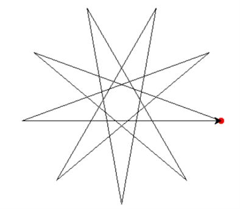
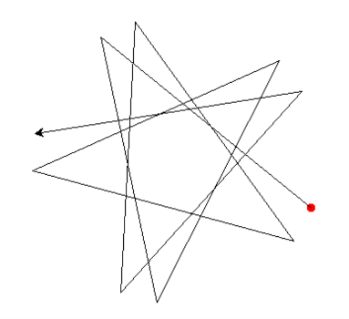
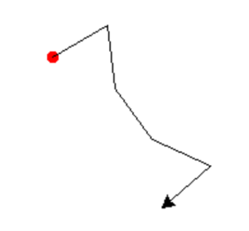
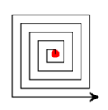

# ENGR 102 Lab Topic 13 (individual)

## Activities
There are two deliverables for this individual assignment. Please submit the following files to **Canvas**. Check out the [Frequently Asked Questions](#frequently-asked-questions) below. **Please include the individual header in your ~.py file.**

1. [Drawing with turtle graphics](#drawing-with-turtle-graphics)

## Drawing with turtle graphics
By combining simple rules, we can use turtle graphics to create all sorts of figures. [The Python documentation of the turtle module](https://docs.python.org/3.3/library/turtle.html) may be helpful.

### Part A
Consider a sequence of nine zeros: `000000000`. What would happen if a turtle was instructed to turn a certain angle and then move forward a certain amount for each zero in the sequence. If there was a sequence of nine zeros, and an angle of 160°, the following python program will create the plot shown below.

```python
import turtle as t	
t.dot(10, "red")
for i in range(9):
    t.left(160)
    t.forward(300)
t.done()
```



With an angle of 160°, it takes nine iterations to make a figure where the turtle has returned to its starting point. However, if the turn angle is set to 141° and the number of iterations stays at nine, the plot below is created. The turtle has obviously not returned to its starting point, and the figure is incomplete. In a file named `turtle_art.py` write a python function named `parta` that takes in as a parameter a turn angle, then determines the smallest number of iterations needed for the turtle to return to its starting point and plots the resulting figure.



**Hint:** Every point where the turtle changes direction falls on a circle.


### Part B
Now consider the sequence `01001`, where each zero corresponds to a turn of 30° and move forward, and each one corresponds to a turn of -114° and move forward. One iteration of this sequence is shown below. Write a python function named `partb` that takes in as a parameter a sequence (string) of ones and zeros, then determines the smallest number of iterations needed for the turtle to return to its starting point and plots the resulting figure. Make sure you test your function with different sequences.




### Part C
Another sequence for making turtle plots is the spiral sequence `110100100010000`. This sequence consists of a one followed by an increasing number of zeros. The first one is followed by no zeros, the second one is followed by one zero, the third one is followed by two zeros, and so on. Each zero corresponds to a turn of 0° and move forward, and each one corresponds to a turn of 90° and move forward. A spiral sequence with 20 ones (and their corresponding zeros) is shown below. Write a python function named `partc` that takes in as parameters a sequence (string), the angle corresponding to zero, and the angle corresponding to one. Then have the function plot the resulting figure. Make sure your function can handle different values for the parameters described. You may want to adjust the distance the turtle moves forward so that the plot does not become too large.



### Main
In your main code, call all of your functions to plot the requested figures using the function calls below. More specifically, call your function `parta` with an angle of 160°, then again with an angle of 141°. Next, call your function `partb` with a sequence of `01001`, then again with a sequence of `01001011`. Next, call your function `partc` with a sequence containing 20 ones and turn angles of 0° and 90°, then again with the same sequence and turn angles of 0° and 30°. Next call your function `partc` with a sequence containing 50 ones and turn angles of 0° and 150°, and again with the same sequence containing 50 ones and turn angles of 5° and 108°.

You may add additional functions and/or lines of code to print information, pause your program, or generate sequences as needed. **Don't forget to include docstrings in all of your functions!** Then, in a file named `turtle_plots.pdf` copy each figure created from your function calls and write a caption to indicate which figure is which. Submit both your python file and your pdf to Canvas.

```python
# main code
parta(160)
input()    # this is one way to pause your program
t.reset()  # this will clear the turtle window (start over)
parta(141)
partb("01001")
partb("01001011")
seq1 = ""  # create a spiral sequence with 20 ones
partc(seq1, 0, 90)
partc(seq1, 0, 30)
seq2 = ""  # create a spiral sequence with 50 ones
partc(seq2, 0, 150)
partc(seq2, 5, 108)
t.done()   # only need once (at the end) so the window doesn't close
```

## Frequently Asked Questions
1. **What goes in the pdf?** Put screenshots of all of your turtle plots in the file. That way we can easily compare against the correct plots. Please include captions for each plot so we know which is which!

2. **What's up with all the function calls at the end?** You are required to write a total of three functions (but it's okay to write more). You need to call `parta` twice (with different arguments), `partb` twice (with different arguments), and `partc` four times (with... you guessed it... different arguments). You may include other lines of code if you want. Things like `input()` statements (to pause your code), the turtle reset function to clear the window, and more.

3. **Are you really going to run my code?** Yes! How else would we know that it works?

Have a question you don't see here? Email your instructor!

Revised Summer 2026 SNR
